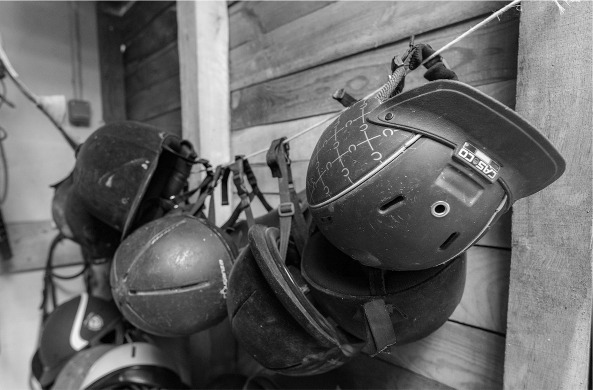

# image-slider
image slider with fade animation and autoplay

## Usage

include the "slider.js" file at the bottom of your html file.

Call the folowing functions:

```javascript

let slider = new slider(document.getElementsByClassName("imageClassName"),
                        document.getElementById("prevArrow") 'optional; replace with null.'
                        document.getElementById("nextArrow") 'optional; replace with null.'
                        indexOfTheFirstImageYouWantToShow);

slider.basicSliderLayout();

slider.prevNextSlide(); 'optional; only if you have prev and next arrow.'

slider.autoPlay(timeBetweenSlides);


```

html file should look something like this example:

```html
<!DOCTYPE html>
<html>

    <head>
        <meta charset="utf-8">
        <title>slider</title>
        <link rel="stylesheet" href="./main.css">
    </head>

    <body>
        <h1>A verry simple image slider with autoplay</h1>
        <div class="sliderWrapper">
            <p id="prev">&lt</p>
            <p id="next">&gt</p>
            
            
            
            
            
        </div>


        <script src="./slider.js"></script>
        <script>
```


            ```javascript

            let slider = new Slider(document.getElementsByClassName("sliderImage"),
            document.getElementById("prev"), document.getElementById("next"), 0);

            slider.basicSliderLayout();
                    
            slider.prevNextSlide();
                    
            slider.autoPlay(7000);

            ```

```html
        </script>
    </body>
</html>
```
